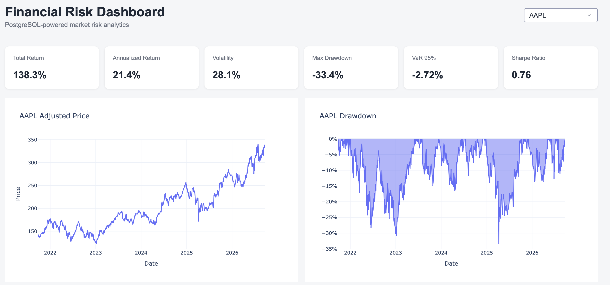
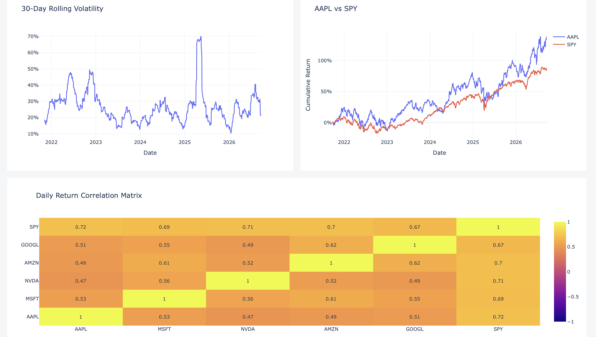

# Financial Risk Dashboard

Interactive financial-risk analytics dashboard powered by PostgreSQL, SQL, Python, Plotly and Dash.

The project ingests historical market data, stores it in PostgreSQL, computes deterministic financial-risk metrics through SQL and Python, and presents the results through an interactive dashboard.

## Dashboard Preview

### Overview



### Risk Analytics and Correlation



## Key Features

- PostgreSQL market-data storage
- Reproducible SQL schema
- Data-quality validation queries
- SQL window functions, CTEs and analytical views
- Daily and cumulative returns
- Annualized volatility
- Maximum drawdown
- Historical Value at Risk at 95% and 99%
- Sharpe ratio
- 30-day rolling volatility
- Benchmark comparison against SPY
- Daily-return correlation matrix
- Interactive Dash dashboard

## Assets

The project currently analyses:

- AAPL
- MSFT
- NVDA
- AMZN
- GOOGL
- SPY

The default ingestion window is five years of daily market data.

## Architecture

```text
Yahoo Finance
     |
     v
data_loader.py
     |
     v
PostgreSQL
     |
     v
SQL Views
├── daily_returns
├── risk_metrics
└── price_drawdown_series
     |
     v
database.py
     |
     v
analytics.py
     |
     v
Dash / Plotly
     |
     v
Interactive Financial Risk Dashboard
```

See [docs/architecture.md](docs/architecture.md) for more detail.

## Project Structure

```text
Financial-Risk-Dashboard/
├── app/
│   ├── __init__.py
│   ├── app.py
│   ├── callbacks.py
│   └── layout.py
├── src/
│   ├── __init__.py
│   ├── analytics.py
│   ├── database.py
│   └── data_loader.py
├── sql/
│   ├── 01_create_tables.sql
│   ├── 02_data_quality.sql
│   └── 03_analysis_queries.sql
├── data/
│   └── raw/
│       └── .gitkeep
├── assets/
│   ├── dashboard1.png
│   ├── dashboard2.png
│   └── style.css
├── docs/
│   └── architecture.md
├── .env.example
├── .gitignore
├── README.md
└── requirements.txt
```

## Risk Metrics

### Total Return

Total change in adjusted price across the available period.

### Annualized Return

Average daily return multiplied by 252 trading days.

### Annualized Volatility

Sample standard deviation of daily returns multiplied by the square root of 252.

### Maximum Drawdown

Largest peak-to-trough decline observed in the historical price series.

### Historical VaR

The 5th and 1st percentiles of historical daily returns are used as 95% and 99% historical Value at Risk estimates.

### Sharpe Ratio

Annualized return divided by annualized volatility.

For simplicity, the current implementation assumes a risk-free rate of 0.

## Setup

### 1. Create the environment

```bash
conda create -n financial-risk python=3.12
conda activate financial-risk
pip install -r requirements.txt
```

### 2. Configure PostgreSQL

Create a database:

```sql
CREATE DATABASE financial_risk;
```

Copy `.env.example` to `.env` and fill in the local PostgreSQL user:

```env
DB_NAME=financial_risk
DB_HOST=localhost
DB_PORT=5432
DB_USER=your_postgres_user
DB_PASSWORD=
```

The real `.env` file is intentionally excluded from Git.

### 3. Create the schema

From the project root:

```bash
psql financial_risk -f sql/01_create_tables.sql
```

### 4. Load market data

```bash
python src/data_loader.py
```

The loader uses `ON CONFLICT DO NOTHING`, so repeated executions do not duplicate existing ticker/date records.

### 5. Run data-quality checks

```bash
psql financial_risk -f sql/02_data_quality.sql
```

### 6. Create analytical views

```bash
psql financial_risk -f sql/03_analysis_queries.sql
```

### 7. Launch the dashboard

```bash
python -m app.app
```

Then open:

```text
http://127.0.0.1:8050
```

## Design Principles

SQL is responsible for deterministic relational analysis, including daily returns, volatility, drawdown, Value at Risk and aggregate risk metrics.

Python handles ingestion, database access, rolling analytics, benchmark comparisons and correlation calculations.

Dash and Plotly are used only for presentation and interaction.

## Data Quality

The included SQL checks validate:

- row counts and date coverage;
- missing OHLCV fields;
- duplicate ticker/date combinations;
- non-positive prices;
- inconsistent OHLC relationships.

## Security

The repository does not include PostgreSQL data files, local database exports or credentials.

Local environment configuration belongs in `.env`, which is excluded through `.gitignore`.

## Current Scope

This is a portfolio analytics application, not a trading system or investment recommendation engine. Market data is retrieved through Yahoo Finance using `yfinance`, and historical results should not be interpreted as forecasts.
