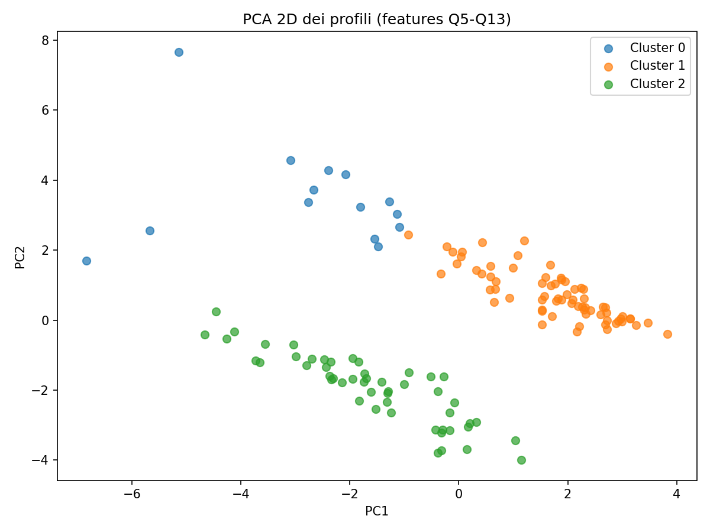

# Survey Data Analysis and Clustering

This repository contains an analysis of a **survey dataset** using **Python**.  
The project covers the full data analysis workflow, including:

- **Data Cleaning**: Handling missing values, correcting data types, and preparing the dataset for analysis.  
- **Descriptive Analysis**: Summarizing key statistics and distributions of the responses.  
- **Exploratory Data Analysis (EDA)**: Visualizing relationships between survey questions and user behaviors.  
- **Gap Analysis**: Comparing expectations vs. perceptions to identify critical areas.  
- **Cluster Analysis**: Segmenting respondents into profiles (e.g., heavy users, pragmatic, conservative).  
- **Logistic Regression**: Modeling and evaluating the likelihood of belonging to specific user groups.  



## Dataset
The dataset contains responses collected through a structured **interview survey**.  
Each record corresponds to a respondent and includes multiple-choice questions (Q1–Q13) covering usage, perceptions, and behaviors.

## Summary

The analysis was performed in several stages:  
- Initial **data cleaning** to address missing values and inconsistencies.  
- **Descriptive and exploratory analysis** to highlight response distributions and correlations.  
- **Gap analysis** to measure satisfaction gaps across questions.  
- **Clustering** to identify user profiles (e.g., heavy users, pragmatic, conservative).  
- **Logistic regression models** to further characterize and predict membership in these clusters.  

The results provide insights into how different groups of respondents behave and perceive the service/product, highlighting areas for improvement and opportunities for targeted strategies.

## Getting Started

To get started with this project, follow these steps:

1. **Clone the repository:**
   
   ```bash
   git clone https://github.com/your-username/dataset-analysis.git

2. **Navigate to the project directory:**

   cd dataset-analysis/survey_analysis

3. **Install required Python packages** (if not already installed):

   pip install pandas numpy matplotlib seaborn scikit-learn statsmodels

## Usage

Open the Jupyter notebook provided in this repository (e.g., survey_analysis_clustering.ipynb).
Run the notebook step by step to perform:

- Data cleaning
- Descriptive statistics
- Exploratory Data Analysis (EDA)
- Gap Analysis
- Cluster Analysis
- Logistic Regression modeling

Review the plots, summaries, and statistical results to interpret the analysis.

This project demonstrates skills in data preprocessing, exploratory data analysis, clustering, and predictive modeling in Python, with a focus on identifying and interpreting user segments from survey data.
