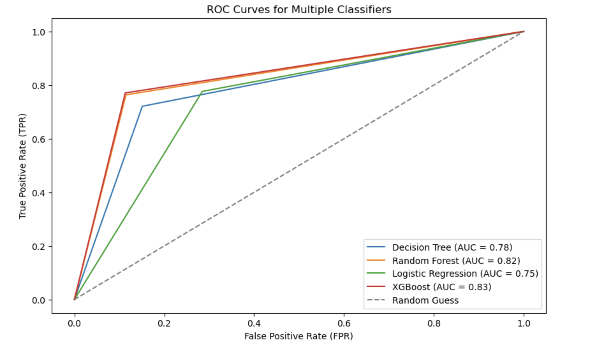

# Credit Risk Classification Analysis

This repository contains an analysis of a **Credit Risk Dataset** using **Python**. The project covers the full machine learning workflow, including:

- **Data Cleaning & Preprocessing**: Handling duplicates, outliers, missing values, and encoding categorical features.  
- **Exploratory Data Analysis (EDA)**: Visualizing distributions, correlations, and class imbalance.  
- **Feature Engineering**: Removing irrelevant columns and applying SMOTE for balancing the dataset.  
- **Machine Learning Modeling**: Training and evaluating multiple classifiers including Decision Tree, Random Forest, Logistic Regression, and XGBoost.  
- **Model Evaluation**: Using metrics such as Accuracy, Precision, Recall, F1 Score, ROC AUC, and visualizing ROC curves.  
- **Feature Importance**: Analyzing the most important features for supported models.



## Dataset
The dataset used in this project comes from Kaggle (https://www.kaggle.com/datasets/laotse/credit-risk-dataset) and contains information on loan applicants, including demographic, financial, and credit history features, along with the loan status.

## Summary
This project aims to predict **loan default risk**. The dataset was first cleaned by removing duplicates and outliers, and categorical variables were encoded. SMOTE oversampling was applied to handle class imbalance.

Multiple classifiers were trained and evaluated on a validation set. The best model was selected based on **accuracy**, and further tested on a separate test set. ROC curves and feature importance were visualized to interpret the models.

This workflow demonstrates the application of **Python, scikit-learn, XGBoost, and imbalanced-learn** for solving a binary classification problem in a financial context.

## Getting Started

To get started with this project, follow these steps:

1. **Clone the repository:**
   
   ```bash
   git clone https://github.com/your-username/credit_risk_classification.git

2. **Navigate to the project directory:**

   cd credit_risk_classification

3. **Install required Python packages (if not already installed):**

   pip install pandas matplotlib seaborn scikit-learn xgboost imbalanced-learn

##Usage

Open the Jupyter Notebook or Python scripts provided in the repository and run them step by step to:

- Explore and visualize the dataset
- Preprocess and encode features
- Apply SMOTE oversampling
- Train multiple classifiers
- Evaluate model performance using Accuracy, Precision, Recall, F1, ROC AUC
- Analyze feature importance and visualize ROC curves
